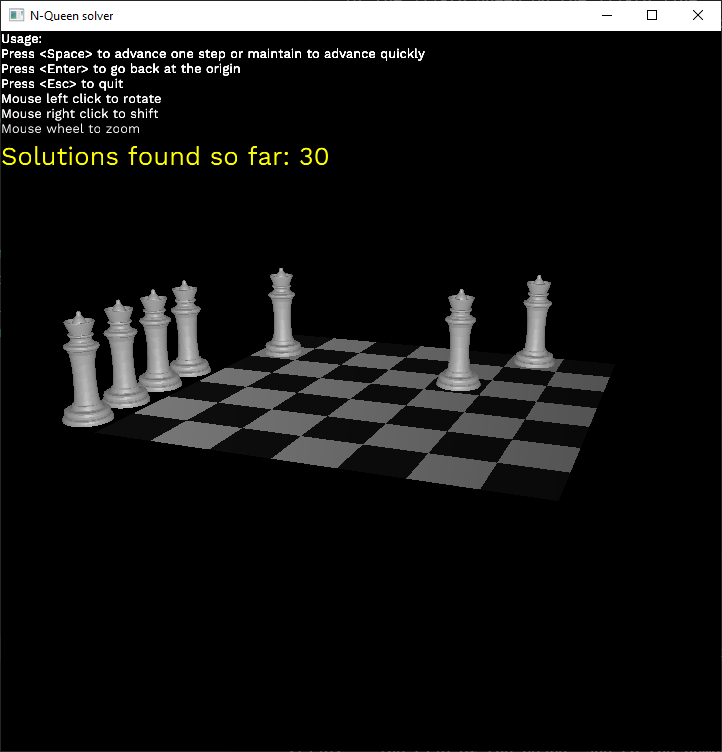

# Software engineering - Exercise 3 - N-Queens solver

## Installation instructions

- Install `rust`. Instructions can be found [here](https://www.rust-lang.org/tools/install))
- Clone this repository
- In the repository folder, use the command `cargo build --release`
- Eat some cookies while it compiles (it might take two or three minutes to gather all packages necessary and to compile everything)
- To run, you can either launch the program from the `target\release` folder, or use the command `cargo run --release -- [program args]`

## Options details

### Strategy

Each exploration of the solutions space is managed by a strategy. A strategy will partition the solutions space in batches. Each batches consist of (eventually partial) solutions which are all displayed by the driver. When a batch ends, the driver will wait for the user if such interaction is enabled.

- `AllSteps`: Each batch holds the next partial solution.
- `SolutionsWithSteps`: Each batch holds the all partial solutions until a complete solution is found. Thus, all partial solutions will be displayed, and once a complete solution is found, it is displayed and the driver eventually wait for the user.
- `OnlySolutions`: Each batch holds the next complete solution. No partial solution is ever shown.
- `OnlyCount`: The batch is empty, and no solution is displayed. However, the solutions space is still fully explored to count the solutions.

### Interaction Mode

- `NoInteraction`: All solutions selected by the strategy option are displayed one after the other
- `WaitUser`: Wait some input from the user to continue the exploration of the solutions space after a batch is finished.
- `WaitOrTimeout`: Not yet implemented. If selected, will behave like `WaitUser`


### Driver
- `Console`:
	Prints a solution as an array in the console. Each element in position *i* indicates the position of the *i*-th queen on the *i*-th line.
	When a solution is found, it is indicated.
	Sample with option `--stop-after-first`:
```
Searching for size 7...
[0]
[0, 2]
[0, 2, 4]
[0, 2, 4, 1]
[0, 2, 4, 1, 3]
[0, 2, 4, 6]
[0, 2, 4, 6, 1]
[0, 2, 4, 6, 1, 3]
[0, 2, 4, 6, 1, 3, 5]
Solution found!
Number of solutions found: 1
```
- `3D`:
	Displays a 3D scene with a board and the queens.
	

## Usage

You can use `--help` to get basic information on each option offered.
```
Solve the N-Queens problem with different modes of interaction and visualisation

USAGE:
    n-queens.exe [FLAGS] [OPTIONS] [size]

FLAGS:
    -h, --help                Prints help information
        --stop-after-first    If enabled, the solver will not output any more steps as soon as a solution is found. Has
                              no effect if the strategy is set to OnlyCount (it will still count all solutions).
    -V, --version             Prints version information

OPTIONS:
        --driver <Driver>                 Select the driver.
                                          'Console' writes in the console.
                                          3D will display a 3D scene to visualise the board.
                                          Default is 'Console'.
                                           [possible values: Console, 3D]
        --interaction <InterationMode>    Select the Interaction Mode. WaitOrTimeout is not yet implemented.
                                          Default is 'WaitUser'.
                                           [possible values: NoInteraction, WaitUser, WaitOrTimeout]
        --strat <Strategy>                Select the strategy. A strategy defines when to stop for the user to interact
                                          and which intermediate steps are shown.
                                          Default is 'SolutionsWithSteps'.
                                           [possible values: AllSteps, SolutionsWithSteps, OnlySolutions, OnlyCount]

ARGS:
    <size>    The size of the board, and so the number of queens. Default is 7
```

## Code organisation

```
root
├─ resources         contains the resources of this repo, like 3d models, images
└─ src               source code folder
   ├─ drivers        contains the source of each driver
   │  ├─ board_3d    the source folder of the 3d driver
   │  │  └── ...
   │  └─ console.rs  the source for the console driver
   ├─ strategies     contains the source of each strategy
   ├─ driver.rs      defines some types and the requirements a driver must meet
   ├─ main.rs        main program, handles command-line options and dispatches them
   ├─ solver.rs      n-queens solver. The function 'search' gives the next partial
   │                 solution. 'backtrack_once' backtrack only one line.
   │                 The solver was implemented with an iterator approach to have
   │                 more flexibility. Using coroutines would have been ideal but
   │                 the language does not fully support this feature
   └─ strategy.rs    defines the requirements a strategy must meet
```